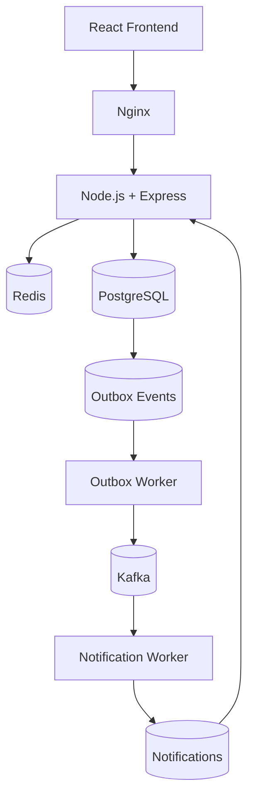

# Reliable Distributed Payment Processing Platform

A production-style payment processing platform built to demonstrate backend engineering, distributed systems, database correctness, concurrency control, asynchronous processing, and reliability patterns.

The platform simulates an internal payment system where authenticated users can manage accounts and transfer funds between them.

> **Note:** This is an educational/internal simulation. It does not process real money and does not implement real banking, KYC, or external payment-network integrations.

---

## Architecture



### Component responsibilities

| Component | Responsibility |
|---|---|
| React + Vite | User interface |
| Nginx | Production frontend serving |
| Node.js + Express | REST API and business logic |
| PostgreSQL | Source of truth for financial state |
| Redis | Distributed rate limiting |
| Kafka | Asynchronous event transport |
| Outbox Worker | Publishes committed outbox events |
| Notification Worker | Processes Kafka events and creates notifications |
| Docker Compose | Runs the complete platform |
| Jest | Backend unit and integration testing |

---

# Core Design

## PostgreSQL as the Source of Truth

All authoritative financial state is stored in PostgreSQL.

The main tables are:

```text
users
accounts
transactions
ledger_entries
idempotency_keys
outbox_events
notifications
schema_migrations
```

Kafka is used for asynchronous event delivery and Redis is used for rate limiting. Neither is treated as the source of truth for account balances.

---

## Money Representation

Money is stored as integer **paise**, not floating-point values.

```text
₹1   = 100 paise
₹500 = 50000 paise
```

PostgreSQL stores monetary values using:

```text
BIGINT
```

This avoids floating-point precision problems in financial calculations.

---

# Transfer Processing

The backend follows a layered architecture:

```text
Route
  ↓
Middleware
  ↓
Controller
  ↓
Service
  ↓
Repository
  ↓
PostgreSQL
```

A transfer request follows this flow:

```text
Client
  ↓
POST /api/transactions/transfer
  ↓
Authentication
  ↓
Rate limiting
  ↓
Validation
  ↓
Transfer Service
  ↓
PostgreSQL transaction
```

Inside the database transaction:

```text
1. Validate the request
2. Resolve the receiver account number
3. Validate the idempotency key
4. Lock the involved accounts
5. Check ownership, status and currency
6. Check sufficient balance
7. Create the transaction
8. Debit the sender
9. Credit the receiver
10. Create DEBIT and CREDIT ledger entries
11. Mark the transaction SUCCESS
12. Attach the transaction to the idempotency record
13. Create the outbox event
14. Commit
```

---

# Reliability Features

## Idempotency

Transfers require an idempotency key.

The system stores:

```text
idempotency key
user
request hash
transaction
expiration
```

The request hash is generated from the internally resolved sender, receiver and amount.

### Same key + same request

The existing transaction is returned instead of creating a duplicate payment.

### Same key + different request

The request is rejected with a conflict response.

This protects the payment endpoint from duplicate client submissions and retries.

---

## Concurrency Control

The transfer operation uses PostgreSQL row-level locks:

```sql
SELECT ... FOR UPDATE
```

When two accounts are involved, locks are acquired in deterministic order.

This prevents competing transfers from modifying the same balances simultaneously without coordination and reduces deadlock risk.

---

## Double-Entry Ledger

A successful transfer creates two ledger records:

```text
Sender   → DEBIT
Receiver → CREDIT
```

For example:

```text
Sender
  DEBIT 50000

Receiver
  CREDIT 50000
```

This provides an auditable representation of the movement of funds.

---

# Transactional Outbox

The payment request must not depend on Kafka being available at the exact moment the database transaction commits.

Without an outbox, a failure between:

```text
database commit
      ↓
Kafka publish
```

could result in a successful payment whose event was never published.

The system instead writes the transaction and the outbox event in the **same PostgreSQL transaction**:

```text
PostgreSQL transaction
        │
        ├── transaction state
        │
        └── outbox event
```

Both commit together.

The outbox worker publishes the event asynchronously after the transaction has committed.

---

# Kafka

Kafka is used for asynchronous transaction events.

Current topic:

```text
transaction-events
```

The development configuration uses:

```text
1 broker
1 partition
1 ISR
```

Kafka runs in **KRaft mode**, so ZooKeeper is not required.

### Kafka listeners

Containers communicate with Kafka using:

```text
payment-kafka:19092
```

Host-side tools can connect using:

```text
localhost:9092
```

The separate listeners prevent Docker containers from incorrectly trying to reach Kafka through their own `localhost`.

---

# Notification Processing

After a successful payment:

```text
PostgreSQL
    ↓
Outbox Event
    ↓
Outbox Worker
    ↓
Kafka
    ↓
Notification Worker
    ↓
notifications table
    ↓
Frontend
```

The notification worker uses the Kafka consumer group:

```text
notification-service
```

Kafka offsets are committed after successful processing.

This provides an **at-least-once processing model**.

---

# Notification Deduplication

Kafka consumers can receive an event more than once.

The notifications table therefore enforces:

```text
UNIQUE(event_id, user_id)
```

The notification worker uses:

```sql
ON CONFLICT DO NOTHING
```

So a redelivered Kafka event does not create a duplicate notification.

The resulting model is:

```text
At-least-once delivery
        +
Database deduplication
        ↓
Safe notification processing
```

---

# Redis Rate Limiting

The transfer route uses a Redis-based token bucket implemented with Lua.

Current configuration:

```text
Capacity: 10 requests
Refill rate: 2 requests/second
```

The rate limit is keyed by the authenticated user.

Relevant response headers include:

```text
X-RateLimit-Limit
X-RateLimit-Remaining
Retry-After
```

Using Redis allows rate-limit state to be shared across multiple backend instances instead of keeping it only in process memory.

---

# Database Migrations

Database schema changes are managed through ordered SQL migrations.

Current migrations:

```text
001_initial_schema.sql
002_reconcile_authoritative_schema.sql
```

The migration runner supports:

- Ordered migration execution
- SHA-256 checksums
- `schema_migrations` tracking
- PostgreSQL advisory locking
- Transactional migration execution

`001_initial_schema.sql` should not be modified after it has been applied.

---

# Authentication and Authorization

The backend uses JWT-based authentication.

The authenticated user identity is used for:

- Authorization
- Account ownership checks
- Idempotency ownership
- Rate-limit keys
- User-specific data access

The transfer API accepts a receiver **account number** rather than exposing the internal receiver UUID as the public identifier.

The backend resolves the account number internally before performing the transfer.

---

# Frontend

The frontend is built with:

```text
React
TypeScript
Vite
React Router
TanStack Query
```

Production frontend serving uses:

```text
Nginx
```

The Docker image uses a multi-stage build:

```text
Node.js
   ↓
Vite production build
   ↓
Nginx
```

Nginx is configured for React SPA routing so routes such as:

```text
/dashboard
/accounts
/transactions
/notifications
```

continue to work after a browser refresh.

User-specific React Query caches are scoped to the authenticated user, and query data is cleared on logout to prevent data from a previous session from being displayed after switching accounts.

---

# Project Structure

```text
.
├── backend/
│   ├── controllers/
│   ├── middleware/
│   ├── repositories/
│   ├── routes/
│   ├── services/
│   ├── workers/
│   ├── scripts/
│   ├── migrations/
│   ├── tests/
│   ├── Dockerfile
│   └── package.json
│
├── frontend/
│   ├── src/
│   ├── public/
│   ├── Dockerfile
│   ├── nginx.conf
│   └── package.json
│
├── docker-compose.yml
├── .env.example
├── .gitignore
└── README.md
```

---

# Tech Stack

### Frontend

- React
- TypeScript
- Vite
- React Router
- TanStack Query
- Nginx

### Backend

- Node.js
- Express
- JavaScript

### Infrastructure

- PostgreSQL
- Redis
- Apache Kafka
- Docker
- Docker Compose

### Testing

- Jest

---

# Docker Setup

The entire platform is managed by Docker Compose.

Services:

```text
postgres
redis
kafka
migrate
backend
frontend
outbox-worker
notification-worker
```

The services communicate over the Compose-managed network:

```text
paymentsystem_payment-network
```

Persistent volumes:

```text
paymentsystem_postgres_data
paymentsystem_redis_data
payment-kafka-data
```

This means PostgreSQL, Redis and Kafka no longer need to be started manually as separate containers.

---

# Ports

| Component | Host | Container |
|---|---:|---:|
| Frontend / Nginx | `8080` | `80` |
| Backend API | `3000` | `3000` |
| PostgreSQL | `5433` | `5432` |
| Redis | `6379` | `6379` |
| Kafka | `9092` | `9092` |

Internal Kafka communication uses:

```text
payment-kafka:19092
```

---

# Environment Variables

Create a local `.env` file from `.env.example`.

### Windows CMD

```cmd
copy .env.example .env
```

### macOS / Linux

```bash
cp .env.example .env
```

Example:

```env
DB_NAME=payment_system
DB_USER=postgres
DB_PASSWORD=postgres

JWT_SECRET=change-this-to-a-long-random-development-secret
JWT_EXPIRES_IN=1h

REDIS_URL=redis://payment-redis:6379
KAFKA_BROKERS=payment-kafka:19092
```

Do not commit `.env` or local database backups.

---

# Running the Project

## Prerequisites

Install:

- Docker Desktop
- Git

The application infrastructure is provided through Docker Compose, so PostgreSQL, Redis and Kafka do not need to be installed separately on the host.

---

## Start the platform

From the project root:

```bash
docker compose up -d
```

For the first build or after changing Dockerfiles/dependencies:

```bash
docker compose up -d --build
```

---

## Check service status

```bash
docker compose ps
```

The long-running services are:

```text
payment-postgres
payment-redis
payment-kafka
payment-backend
payment-frontend
payment-outbox-worker
payment-notification-worker
```

The migration container:

```text
payment-migrate
```

is a one-shot service and is expected to exit successfully after migrations complete.

---

## Open the application

Frontend:

```text
http://localhost:8080
```

Backend:

```text
http://localhost:3000
```

---

# Stopping the Platform

Stop the running containers:

```bash
docker compose stop
```

Start them again:

```bash
docker compose up -d
```

Remove the containers and Compose network while keeping persistent volumes:

```bash
docker compose down
```

Avoid:

```bash
docker compose down -v
```

unless you intentionally want to remove the PostgreSQL, Redis and Kafka data volumes.

---

# Useful Docker Commands

### View service status

```bash
docker compose ps
```

### View all logs

```bash
docker compose logs -f
```

### Backend logs

```bash
docker compose logs -f backend
```

### Outbox worker logs

```bash
docker compose logs -f outbox-worker
```

### Notification worker logs

```bash
docker compose logs -f notification-worker
```

### Kafka logs

```bash
docker compose logs -f kafka
```

### Redis logs

```bash
docker compose logs -f redis
```

---

# Testing

The backend uses Jest for unit and integration testing.

From the backend directory:

```bash
cd backend
npm test
```

The test suite covers reliability-related behavior including:

- Transfer service logic
- Idempotency
- Concurrent transfers
- Outbox atomicity
- Repository behavior
- Failure scenarios

The system has also been manually verified through the Dockerized end-to-end flow:

```text
Transfer
   ↓
PostgreSQL
   ↓
Outbox
   ↓
Kafka
   ↓
Notification Worker
   ↓
Notifications
   ↓
Frontend
```

---

# Reliability Scenarios

## Duplicate transfer request

```text
Client retry
    ↓
Same Idempotency-Key
    ↓
Same request
    ↓
Existing transaction returned
```

No second payment transaction is created.

---

## Concurrent transfers

```text
Concurrent requests
        ↓
SELECT FOR UPDATE
        +
Deterministic lock ordering
        ↓
Safe balance updates
```

---

## Database succeeds while Kafka is unavailable

```text
Payment transaction
       +
Outbox event
       ↓
PostgreSQL commit
       ↓
Kafka temporarily unavailable
       ↓
Outbox remains available
       ↓
Worker publishes later
```

The payment request does not require Kafka to be available synchronously.

---

## Kafka redelivery

```text
Kafka event
    ↓
Notification inserted
    ↓
Consumer crashes before offset commit
    ↓
Kafka redelivers event
    ↓
UNIQUE(event_id, user_id)
    ↓
ON CONFLICT DO NOTHING
```

The notification is not duplicated.

---

# Design Trade-offs

The project intentionally avoids infrastructure that is not necessary for its scope.

It does not currently use:

- Kubernetes
- Service mesh
- Kafka Streams
- Schema Registry
- Distributed databases
- Multiple Kafka brokers
- Large numbers of microservices
- Complex retry frameworks

The goal is to demonstrate correctness and reliability patterns without introducing unnecessary operational complexity.

The current Kafka setup is a single-broker development environment. Production high availability would require replication, multiple brokers, redundant infrastructure, stronger secret management, observability, and deployment automation.

---

# Scope and Limitations

This project is intentionally a simulated internal payment platform.

It does not provide:

- Real banking integration
- Real money movement
- KYC/AML workflows
- External payment gateways
- Card processing
- UPI integration
- Production-grade identity infrastructure

Funds are intended to be created only through development/manual mechanisms.

---

# Future Improvements

Potential future improvements include:

- Refresh-token authentication
- API documentation with OpenAPI
- Metrics and tracing
- Dead-letter handling
- Configurable retry/backoff policies
- CI/CD pipeline
- Production secret management
- Multi-broker Kafka deployment
- Production deployment automation
- Expanded observability

These are intentionally outside the current scope.

---

# Key Engineering Concepts Demonstrated

This project focuses on practical backend and distributed-systems concepts:

```text
Database Transactions
Concurrency Control
Row-Level Locking
Idempotent APIs
Double-Entry Ledger
Transactional Outbox
Event-Driven Architecture
At-Least-Once Processing
Database Deduplication
Distributed Rate Limiting
Layered Backend Architecture
Dockerized Infrastructure
Failure-Aware Design
```

The main goal is not simply to demonstrate that the application works, but to demonstrate **why it remains correct when requests are retried, operations run concurrently, and asynchronous components temporarily fail.**