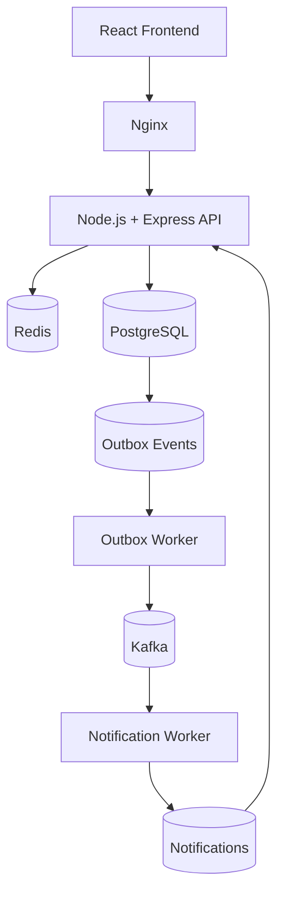

# Reliable Distributed Payment Processing Platform

A production-style, reliability-focused payment processing platform built to demonstrate backend engineering, distributed systems, database correctness, asynchronous processing, concurrency control, and fault-tolerant application design.

This project simulates an internal payment platform where authenticated users can manage financial accounts and transfer funds between accounts.

> **Important:** This is an educational/internal simulation. It does not process real money and does not implement real banking, KYC, or payment-network integrations.

---

## Overview

The system is designed around one core principle:

> **PostgreSQL is the source of truth for all financial state.**

Payment operations are performed inside PostgreSQL transactions, while Kafka is used for asynchronous event processing.

The platform demonstrates several important backend reliability patterns:

- Integer-based money representation
- Database transactions
- Row-level locking
- Deterministic lock ordering
- Idempotency
- Double-entry ledger records
- Transactional outbox
- Asynchronous Kafka processing
- At-least-once event processing with database deduplication
- Redis-based distributed rate limiting
- Request correlation IDs
- Dockerized infrastructure
- Automated backend tests

---

## Architecture



### High-level responsibilities

| Component | Responsibility |
|---|---|
| React + Vite | User interface |
| Nginx | Production serving of the frontend |
| Node.js + Express | REST API and application logic |
| PostgreSQL | Source of truth for users, accounts, transactions, ledger and notifications |
| Redis | Distributed rate limiting |
| Kafka | Asynchronous event transport |
| Outbox Worker | Publishes committed database events to Kafka |
| Notification Worker | Consumes Kafka events and creates notifications |
| Docker Compose | Runs and connects the complete platform |
| Jest | Backend unit and integration testing |

---

# Core Design

## Money Representation

Money is never stored using floating-point values.

Amounts are represented as integer **paise**:

```text
₹1    = 100 paise
₹500  = 50000 paise
```

PostgreSQL stores monetary amounts using:

```text
BIGINT
```

This avoids floating-point precision problems during financial calculations.

Example:

```text
₹500
↓
50000 paise
↓
BIGINT
```

---

## PostgreSQL as the Source of Truth

Financial state is maintained in PostgreSQL.

The major database tables are:

```text
users
accounts
transactions
ledger_entries
idempotency_keys
outbox_events
notifications
schema_migrations
```

The system does not rely on Redis or Kafka as the authoritative source for account balances.

Kafka is an event transport mechanism, while Redis is used for rate limiting.

---

# Transfer Flow

A transfer follows the application structure:

```text
Route
  ↓
Middleware
  ↓
Controller
  ↓
Service
  ↓
Repository
  ↓
PostgreSQL
```

A simplified transfer flow is:

```text
Client
  ↓
POST /api/transactions/transfer
  ↓
Authentication
  ↓
Rate Limiting
  ↓
Validation
  ↓
Transfer Service
  ↓
PostgreSQL Transaction
```

Inside the database transaction:

```text
1. Resolve receiver account number
2. Validate idempotency key
3. Acquire account row locks
4. Validate ownership/status/currency
5. Check sufficient balance
6. Create transaction
7. Debit sender
8. Credit receiver
9. Create ledger entries
10. Mark transaction SUCCESS
11. Attach transaction to idempotency key
12. Create outbox event
13. Commit
```

Only after the database transaction commits does the event become eligible for asynchronous publishing.

---

# Concurrency Control

Payment transfers can be executed concurrently.

To prevent inconsistent balances and race conditions, the system uses PostgreSQL row-level locking.

Accounts are locked using:

```sql
SELECT ... FOR UPDATE
```

The system also applies **deterministic lock ordering**.

For example, if two accounts participate in a transfer:

```text
smaller account UUID
      ↓
larger account UUID
```

This means concurrent transfers acquire locks in a consistent order.

The purpose is to reduce the possibility of deadlocks while ensuring that balance modifications are serialized correctly.

---

# Idempotency

Payment APIs must protect against duplicate requests.

The transfer operation accepts an idempotency key.

For example:

```http
Idempotency-Key: 8c7e2...
```

The server stores:

```text
idempotency key
user
request hash
transaction
expiration
```

The request hash is based on the internal identities of the sender and receiver and the requested amount.

### Same request + same key

```text
Request 1
    ↓
Transaction created

Request 2
same idempotency key
same request
    ↓
Return the same transaction
```

### Same key + different request

```text
Request A
Idempotency-Key: abc

Request B
Idempotency-Key: abc
different amount/receiver
```

The second request is rejected.

This prevents accidental duplicate payments caused by client retries.

---

# Ledger

Successful transfers create ledger records representing both sides of the movement.

A transfer creates:

```text
DEBIT  → sender account
CREDIT → receiver account
```

For example:

```text
Sender
  DEBIT 50000

Receiver
  CREDIT 50000
```

This provides an auditable representation of the movement of funds.

---

# Transactional Outbox

A major reliability problem in distributed systems is the dual-write problem.

Consider:

```text
Database transaction
        +
Kafka publish
```

If the database commits but Kafka publishing fails, the payment would succeed but the event could be lost.

This project solves that using the **Transactional Outbox Pattern**.

Instead of publishing to Kafka directly from the request transaction:

```text
PostgreSQL transaction
        ↓
transaction state
        +
outbox event
```

Both are committed atomically.

Therefore:

```text
Payment SUCCESS
      +
Outbox Event
```

either commit together or roll back together.

The outbox worker later publishes the event to Kafka.

---

# Outbox Worker

The outbox worker continuously looks for unpublished events.

The lifecycle is:

```text
PENDING
   ↓
PROCESSING
   ↓
PUBLISHED
```

If publishing fails, the event can remain available for later processing.

Important fields include:

```text
status
attempts
available_at
locked_at
published_at
last_error
```

This keeps asynchronous event publication separate from the user-facing payment request.

---

# Kafka

Kafka is used as the asynchronous event transport layer.

The platform uses:

```text
Topic:
transaction-events
```

The current development setup uses:

```text
1 partition
1 broker
1 ISR
```

Kafka is configured in **KRaft mode**, so the project does not depend on ZooKeeper.

### Kafka listener setup

Inside Docker:

```text
payment-kafka:19092
```

From the Windows host:

```text
localhost:9092
```

This distinction is important because containers communicate using Docker service names, while tools running directly on the host use `localhost`.

---

# Notification Processing

After a transfer succeeds:

```text
PostgreSQL
   ↓
outbox event
   ↓
Outbox Worker
   ↓
Kafka
   ↓
Notification Worker
   ↓
notifications table
   ↓
Frontend
```

The notification worker belongs to the Kafka consumer group:

```text
notification-service
```

Kafka offsets are committed **after successful processing**.

This gives the system an at-least-once processing model.

---

# Duplicate Notification Protection

At-least-once processing means an event can potentially be delivered more than once.

To make notification processing safe, the database contains a uniqueness constraint:

```text
UNIQUE(event_id, user_id)
```

The consumer uses:

```sql
ON CONFLICT DO NOTHING
```

Therefore:

```text
Kafka Event
   ↓
Notification inserted
   ↓
Consumer crashes before offset commit
   ↓
Kafka redelivers event
   ↓
Database sees duplicate
   ↓
ON CONFLICT DO NOTHING
```

The result is no duplicate notification.

---

# Redis Rate Limiting

Redis is used for distributed request rate limiting.

The transfer route uses a **Lua-based token bucket**.

Current configuration:

```text
Capacity: 10 requests
Refill rate: 2 requests/second
```

The bucket is keyed by the authenticated user.

Relevant response headers include:

```text
X-RateLimit-Limit
X-RateLimit-Remaining
Retry-After
```

Using Redis rather than process-local memory allows rate-limit state to be shared across multiple backend instances.

---

# Authentication

The backend uses JWT-based authentication.

Authenticated requests provide the user's identity to the backend.

The user identity is then used for:

- Authorization
- Account ownership checks
- Idempotency ownership
- Rate-limit keys
- User-specific data access

The backend does not trust a client-supplied receiver UUID during transfer processing.

Instead:

```text
Receiver account number
        ↓
Backend lookup
        ↓
Internal receiver UUID
```

This keeps internal database identifiers separate from the external account-number interface.

---

# Request IDs and Logging

The backend uses request correlation IDs to make requests easier to trace across logs.

This is useful when following a flow such as:

```text
HTTP request
   ↓
transaction
   ↓
outbox
   ↓
Kafka event
   ↓
notification processing
```

Workers emit structured JSON logs containing identifiers such as:

```text
eventId
transactionId
topic
partition
offset
timestamp
```

This helps connect an event across different components.

---

# Database Migrations

Database schema changes are managed through ordered SQL migration files.

Current migrations:

```text
001_initial_schema.sql
002_reconcile_authoritative_schema.sql
```

The migration runner provides:

- Ordered execution
- SHA-256 checksums
- `schema_migrations` tracking
- PostgreSQL advisory locking
- Transactional migration execution

Migration `001_initial_schema.sql` should not be modified after it has been applied.

---

# Project Structure

```text
.
├── backend/
│   ├── controllers/
│   ├── middleware/
│   ├── repositories/
│   ├── routes/
│   ├── services/
│   ├── workers/
│   ├── scripts/
│   ├── tests/
│   ├── migrations/
│   ├── Dockerfile
│   └── package.json
│
├── frontend/
│   ├── src/
│   ├── public/
│   ├── Dockerfile
│   ├── nginx.conf
│   └── package.json
│
├── docker-compose.yml
├── .env.example
├── .gitignore
└── README.md
```

---

# Docker Architecture

The entire application infrastructure is managed using Docker Compose.

Services:

```text
postgres
redis
kafka
migrate
backend
frontend
outbox-worker
notification-worker
```

Compose also manages the application network:

```text
paymentsystem_payment-network
```

Persistent volumes:

```text
paymentsystem_postgres_data
paymentsystem_redis_data
payment-kafka-data
```

This means Redis and Kafka no longer need to be started manually as separate Docker containers.

---

# Ports

| Component | Host Port | Container Port |
|---|---:|---:|
| Frontend / Nginx | 8080 | 80 |
| Backend API | 3000 | 3000 |
| PostgreSQL | 5433 | 5432 |
| Redis | 6379 | 6379 |
| Kafka | 9092 | 9092 |

Kafka's internal Docker listener is:

```text
payment-kafka:19092
```

---

# Environment Configuration

Create the local environment file from the example:

```bash
copy .env.example .env
```

or create `.env` manually.

A development configuration looks like:

```env
DB_NAME=payment_system
DB_USER=postgres
DB_PASSWORD=postgres

JWT_SECRET=change-this-to-a-long-random-development-secret
JWT_EXPIRES_IN=1h

REDIS_URL=redis://payment-redis:6379
KAFKA_BROKERS=payment-kafka:19092
```

> `.env` should remain local and must not be committed to Git.

---

# Running the Project

## Prerequisites

Install:

- Docker Desktop
- Git

The Docker setup provides:

- PostgreSQL
- Redis
- Kafka
- Backend
- Frontend
- Workers

So the complete platform can be run without separately installing PostgreSQL, Redis, or Kafka on the host.

---

## Start the complete platform

From the project root:

```bash
docker compose up -d
```

For the first build, or after Dockerfile/dependency changes:

```bash
docker compose up -d --build
```

---

## Check service status

```bash
docker compose ps
```

Expected long-running services:

```text
payment-postgres
payment-redis
payment-kafka
payment-backend
payment-frontend
payment-outbox-worker
payment-notification-worker
```

The migration service is a one-shot container and is expected to exit successfully:

```text
payment-migrate
```

---

## Open the application

Frontend:

```text
http://localhost:8080
```

Backend:

```text
http://localhost:3000
```

PostgreSQL:

```text
localhost:5433
```

Redis:

```text
localhost:6379
```

Kafka:

```text
localhost:9092
```

---

# Stopping the Platform

Stop the running services without removing volumes:

```bash
docker compose stop
```

Start them again:

```bash
docker compose up -d
```

To remove the containers and network while keeping persistent volumes:

```bash
docker compose down
```

> Avoid `docker compose down -v` unless you intentionally want to delete the Compose-managed database, Redis, and Kafka volumes.

---

# Useful Docker Commands

### View all services

```bash
docker compose ps
```

### Follow all logs

```bash
docker compose logs -f
```

### Backend logs

```bash
docker compose logs -f backend
```

### Outbox worker logs

```bash
docker compose logs -f outbox-worker
```

### Notification worker logs

```bash
docker compose logs -f notification-worker
```

### Kafka logs

```bash
docker compose logs -f kafka
```

### Redis logs

```bash
docker compose logs -f redis
```

### PostgreSQL logs

```bash
docker compose logs -f postgres
```

---

# Testing

The backend uses Jest for unit and integration testing.

Run the test suite from the backend directory:

```bash
cd backend
npm test
```

The test suite covers important reliability behavior including:

- Transaction service logic
- Concurrency
- Idempotency
- Outbox atomicity
- Failure scenarios
- Repository behavior

The project has previously been validated with backend unit/integration tests covering the core payment reliability paths.

---

# Reliability Scenarios

The system is designed around several important failure scenarios.

## Duplicate payment request

```text
Client retry
   ↓
Same Idempotency-Key
   ↓
Same request hash
   ↓
Return existing transaction
```

No duplicate transaction is created.

---

## Same idempotency key with a different request

```text
Existing key
     +
Different request hash
     ↓
409 Conflict
```

This prevents accidental key reuse for a different operation.

---

## Concurrent transfers

Two requests attempt to modify overlapping accounts.

The system uses:

```text
SELECT FOR UPDATE
+
deterministic lock ordering
+
database transaction
```

to maintain correct balances.

---

## Database commit succeeds but Kafka is unavailable

The payment transaction still commits together with an outbox event.

The Kafka publication can happen later.

```text
Payment
  ↓
DB transaction commits
  +
Outbox event
  ↓
Kafka temporarily unavailable
  ↓
Outbox event remains available
  ↓
Worker retries publication
```

The payment does not depend on synchronous Kafka availability.

---

## Kafka event is delivered more than once

The notification worker may see the same event again.

The database constraint:

```text
UNIQUE(event_id, user_id)
```

prevents duplicate notifications.

---

# Design Trade-offs

This project intentionally avoids unnecessary infrastructure.

It does not currently use:

- Kubernetes
- Service mesh
- Kafka Streams
- Schema Registry
- Distributed databases
- Kafka clusters with multiple brokers
- Complex retry frameworks
- Large numbers of microservices

The goal is to demonstrate **correct engineering decisions and reliability patterns without introducing infrastructure that is unnecessary for the scope of the project**.

For a single-node educational environment, the current Kafka configuration uses one broker and one partition.

In a production deployment, higher availability would require additional Kafka brokers, replication, infrastructure redundancy, secrets management, observability, and deployment automation.

---

# Frontend

The frontend is built using:

```text
React
Vite
Nginx
```

The production Docker image uses a multi-stage build:

```text
Node.js build stage
       ↓
Vite production build
       ↓
Nginx runtime
```

Nginx is configured to support React client-side routing:

```nginx
try_files $uri $uri/ /index.html;
```

This allows routes such as:

```text
/dashboard
/accounts
/transactions
/notifications
```

to work correctly after a browser refresh.

---

# Frontend Session Data Isolation

Authenticated frontend data is scoped to the current user.

React Query keys include the authenticated user identity for user-specific data such as:

```text
accounts
notifications
transactions
```

The application also clears cached query data when the user logs out.

This prevents data from the previous authenticated session from being displayed after switching users.

---

# API Architecture

The backend follows a layered structure:

```text
Route
 ↓
Middleware
 ↓
Controller
 ↓
Service
 ↓
Repository
 ↓
PostgreSQL
```

### Route

Defines the HTTP endpoint.

### Middleware

Handles cross-cutting concerns such as:

- Authentication
- Validation
- Rate limiting
- Request IDs

### Controller

Handles HTTP-specific concerns and responses.

### Service

Contains business logic and reliability rules.

### Repository

Handles database interaction.

This separation keeps business logic independent from the HTTP layer and database implementation details.

---

# Security and Data Handling

The project includes:

- JWT-based authentication
- Authenticated-user authorization checks
- Account ownership checks
- Idempotency protection
- Rate limiting
- Environment-based secrets
- `.env` excluded from Git
- Database backups excluded from Git

This is a development/educational platform and should not be used to process real financial funds.

---

# Development Notes

The project is intentionally kept in JavaScript/TypeScript for the application stack.

The backend uses JavaScript with:

```text
Node.js
Express
PostgreSQL
Redis
Kafka
Jest
```

The frontend uses:

```text
React
Vite
TypeScript
Nginx
```

Infrastructure is managed through:

```text
Docker
Docker Compose
```

---

# Future Improvements

Potential future improvements, depending on project requirements, include:

- Authentication token rotation
- Refresh-token support
- Better secret management
- API documentation with OpenAPI
- More extensive observability
- Metrics and tracing
- Dead-letter handling for permanently failing events
- Configurable retry/backoff policies
- Multiple Kafka brokers for high availability
- CI/CD pipeline
- Production deployment automation

These are intentionally not part of the current implementation because the project's goal is to demonstrate the core reliability architecture without unnecessary complexity.

---

# Why This Project

This project demonstrates practical backend and distributed-systems concepts that are important in real software engineering environments:

- Database transaction correctness
- Concurrency control
- Idempotent APIs
- Event-driven architecture
- Transactional outbox
- At-least-once processing
- Database-backed deduplication
- Distributed rate limiting
- Layered backend architecture
- Containerized infrastructure
- Failure-aware system design

The primary goal is to demonstrate not only that the application works, but also **why the architecture behaves correctly under retries, concurrency, service failures, and asynchronous processing.**

---

# Tech Stack

### Frontend

- React
- Vite
- TypeScript
- Nginx

### Backend

- Node.js
- Express
- JavaScript

### Data and Infrastructure

- PostgreSQL
- Redis
- Apache Kafka
- Docker
- Docker Compose

### Testing

- Jest

---

# License

This project is intended for educational and portfolio purposes.